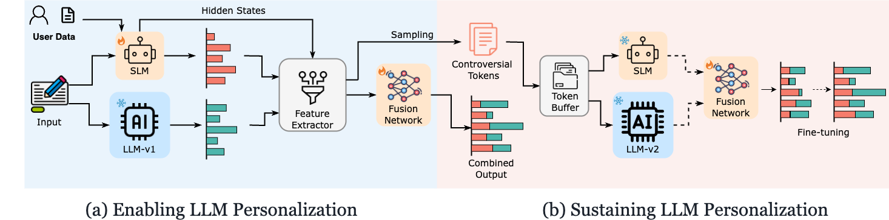

# Echo: Enabling Sustained LLM Personalization based on Model Collaboration

This repository contains the code implement of the paper Echo: Enabling Sustained LLM Personalization based on Model Collaboration,

## Framework



## Getting started

- Echo is a novel on-device solution for sustained LLM personalization based on model collaboration.
- Echo integrates a pretrained small model with a frozen LLM using a learnable **fusion network**, which dynamically balances the contributions of the two models at the token level. This design allows Echo to personalize predictions efficiently, even under evolving LLM environments.
- Echo introduces a **token-level replay mechanism** to adapt the fusion network when the LLM is updated, **without re-accessing full user data or retraining the SLM itself**. The framework only retains a small number of informative tokens for replay, making it highly suitable for resource-constrained edge devices like mobile phones.

## Experiment

You need to first download the [LaMP](https://github.com/LaMP-Benchmark/LaMP) benchmark data into the directory `data/`.In this experiment we randomly select users with more than 150 interaction records to simulate a realistic setting201
where personalized information is accumulated on the user side. In each experiment, we randomly sample 10 users, run their inputs through Echo and the baselines, and report their performance averaged across these users.

### Single Model Training

```shell
python run_model_trainer.py
```

### Fusion Network Training

```shell
python run_funsion_network_trainer.py
```

### Replay for sustaining llm personalization

```shell
python run_replay_trainer.py
```

### Parameters setting

You can set parameters in `config/config.yaml`
